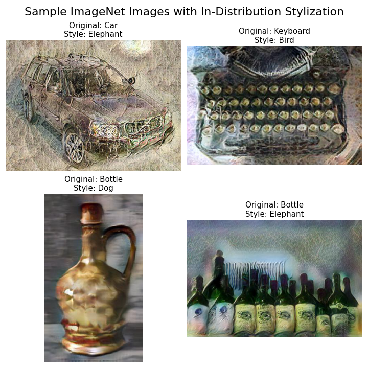
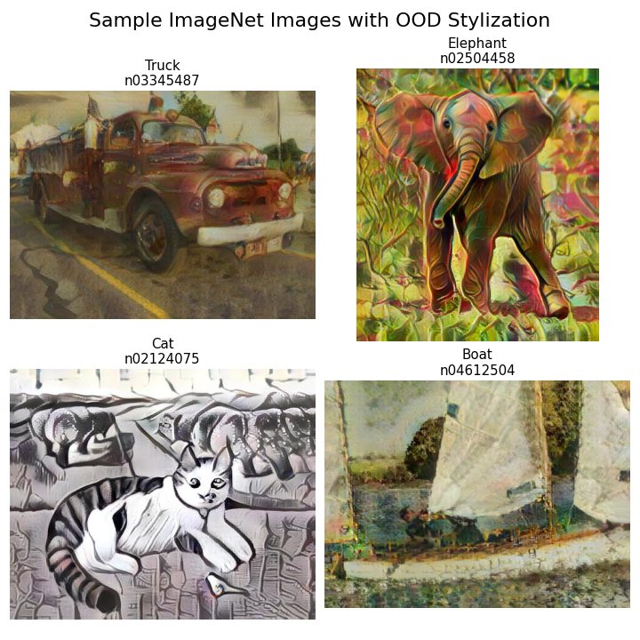
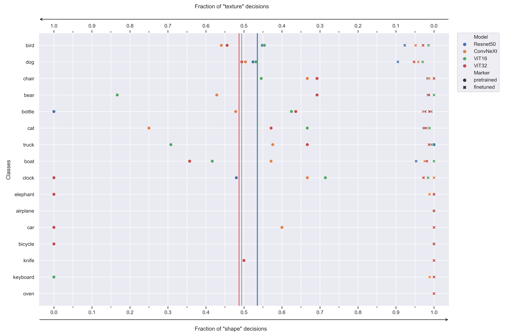

# Convolutional vs Attention Inductive Biases

[](https://github.com/PulkitMadan/convolution-vs-attention)
[](https://wandb.ai/ift6759-avengers/CNNs%20vs%20Transformers)

Image recognition in computer vision has been regarded as one of the forefront of deep learning with
Alexnet (Krizhevsky et al., 2012) as one of the first convolutional neural network (CNN) to reach
a state of the art performance on ImageNet (Deng et al., 2009). Despite the success of CNNs, there has
been a recent trend with new architectures which utilizes attention modules described as Vision Transformers (ViT)
(Dosovitskiy et al., 2021).

These two architectures have been shown to have different inductive biases when trained to classify conflicting
images based on their shape vs texture (Geirhos et al., 2019). Our experiments have shown that training
on a more diverse out of distribution (OOD) stylized dataset allows models regardless of architecture to learn a more
global shape representation. This however does reduce the accuracy for the task which the architecture was first
pretrained on but allows better performance when generalizing towards other tasks, such as melanoma skin cancer
classification where both local and global representations are important (Codella et al., 2019).

We also introduce a smaller version of stylized-ImageNet, one that is similar in spirit to TinyImageNet (Le et Yang.,

2015)

in terms of the number of classes and number of sample per class, but differs in that it consists of full resolution
images.

### Table of Content

- [Authors](#authors)
- [Data](#data)
- [Data Samples](#data-samples)
- [Result Figure](#result-figure)
- [Run Locally](#run-locally)
- [Run on Cluster](#run-on-cluster)
- [Environment Variables](#environment-variables)
- [WandB Run Locally](#wandb-run-locally)
- [Documentation](#documentation)

## Authors

- [@AxelBogos](https://www.github.com/AxelBogos)
- [@Pulkit Madan](https://www.github.com/PulkitMadan)
- [@Jizhou Wang](https://www.github.com/Jawing)
- [@Abhay Puri](https://www.github.com/abhaypuri)

## Data

To reproduce our experiments, the following datasets are necessary to build the Tiny-ish stylized dataset:

* 2012 ILSVRC [ImageNet](image-net.org)
* [Kaggle Painter by Numbers](https://www.kaggle.com/c/painter-by-numbers)

To build the dataset,

1. Download 2012 ILSVRC [ImageNet](image-net.org)
2. Download [Kaggle Painter by Numbers](https://www.kaggle.com/c/painter-by-numbers)
3. Run `src/data/process_image_net_subset.py` to build and save the relevent subsample of ImageNet. You need to modify
   your local
   paths within the `.py` file
4. Upload zipped version of ImageNet subset and the Kaggle Painter By Numbers dataset on Colab, a cluster or simply
   leave it
   on your local machine if you have a reasonably powerful GPU.
5. Follow instructions in `notebooks/stylize_dataset_colab.ipynb`. The script will need to be run twice, once for
   in-distribution
   stylizaton and once for OOD stylization. The notebook follows roughly the process given
   by [bethgelab](https://github.com/bethgelab/stylize-datasets).
6. You may now experiment with both the OOD and ID stylization sets. To reproduce our setup, use the **OOD sets for
   train and val**
   and the **ID set for test**.

The ImageNet subset, OOD set and ID sets are also
available [here](https://drive.google.com/drive/folders/1_titTLm3vsYMnlKJWz-5ssohmsFF2Zbl?usp=sharing) for now, but
might be deleted in the future for storage constraints.

## Data Samples




## Result Figure

Brief overview of our main result. We see that fine-tuning on our Tiny-ish version of stylized ImageNet push all
models towards a more shape-biased representation.



## Run Locally

Clone the project

```bash
  git clone https://github.com/PulkitMadan/convolution-vs-attention.git
```

Go to the project directory

```bash
  cd my-project
```

Create virtual environment

* with venv:

```bash
  python3 -m venv /path-to-new-virtual-env/<env_name>
  (or virtualenv /path-to-new-virtual-env/<env_name>)
  source /path-to-new-virtual-env/<env_name>/bin/activate
  pip install -r requirements.txt
```

* with conda:

```bash
conda create --name <env_name> --file requirements.txt
conda activate <env_name>
```

* with conda (environment.yml)

Conda uses the provided `environment.yml` file. You can ignore `requirements.txt` if you choose this method. Make sure
you have [Miniconda](https://docs.conda.io/en/latest/miniconda.html)
or [Anaconda](https://www.anaconda.com/products/individual) installed on your system. Once installed, open up your
terminal (or Anaconda prompt if you're on Windows). Install the environment from the specified environment file:

    conda env create --file environment.yml
    conda activate <env_name>

After you install, register the environment so jupyter can see it:

    python -m ipykernel install --user --name=<env_name>

You should now be able to launch jupyter and see your conda environment:

    jupyter-lab

If you make updates to your conda `environment.yml`, you can use the update command to update your existing environment
rather than creating a new one:

    conda env update --file environment.yml    

You can create a new environment/requirements file using the commands below:

    conda env export > environment.yml
    conda list -e > requirements.txt
    pip list --format=freeze > requirements.txt

Run training, select --model (resnet,vit,convnext,coatnet) and load pretrained weights:

    python train.py --train --model resnet --pretrain  

Run testing/visualization with resnet and load fintuned model if available, pretrained model otherwise:

    python train.py --model resnet --pretrain --load

Additional arguments for `train.py`:

* `--frozen`: Freeze model parameters except for the last layer
* `--mela`: Use the melanoma dataset
* `--combined_data`: Use the combined original IN and SIN dataset
* `--name`: Set the name of the run in WandB
* `--data_dir`: Set the root path of your dataset. By default, `./data/processed`
* `--trained_model_dir`: Set the path to your directory to store and load trained models. By
  default, `./models/trained_models`
* `--patience`: Set early stopping patience. By default 5
* `--num_epoch`: Set the number of training epochs. By default 80
* `--batch_size`: Set the mini-batch size. By default 64.
* `--random_seed`: Set the random seed for reproducibility. By default `123`, recommended not to change.

## Run on Cluster

See the `cluster.sh` bash script file in `./bash_scripts`. To launch an experiment on the cluster, modify
the `python train.py --.....` command at the bottom of the file to your liking, see **Run Locally** for details about
the arguments.
To run the experiment on the cluster, copy `cluster.sh` on the cluster and run
`sbatch <your_path...>/cluster.sh scratch/code-snapshots/convolution-vs-attention/`

## Environment Variables

To run this project, you will need to add the following environment variables to your `.env` or `.bashrc` file

`$WANDB_API_KEY` : Your [Weights and Biases](https://wandb.ai/home) API Key

## WandB Run Locally

Install wandb library and login: <br>
```pip install wandb``` <br>
```wandb login``` <br>
You have to put your API key. You can get it from here https://wandb.ai/authorize

Then you can run your respective Python command.

## Documentation

TBA

